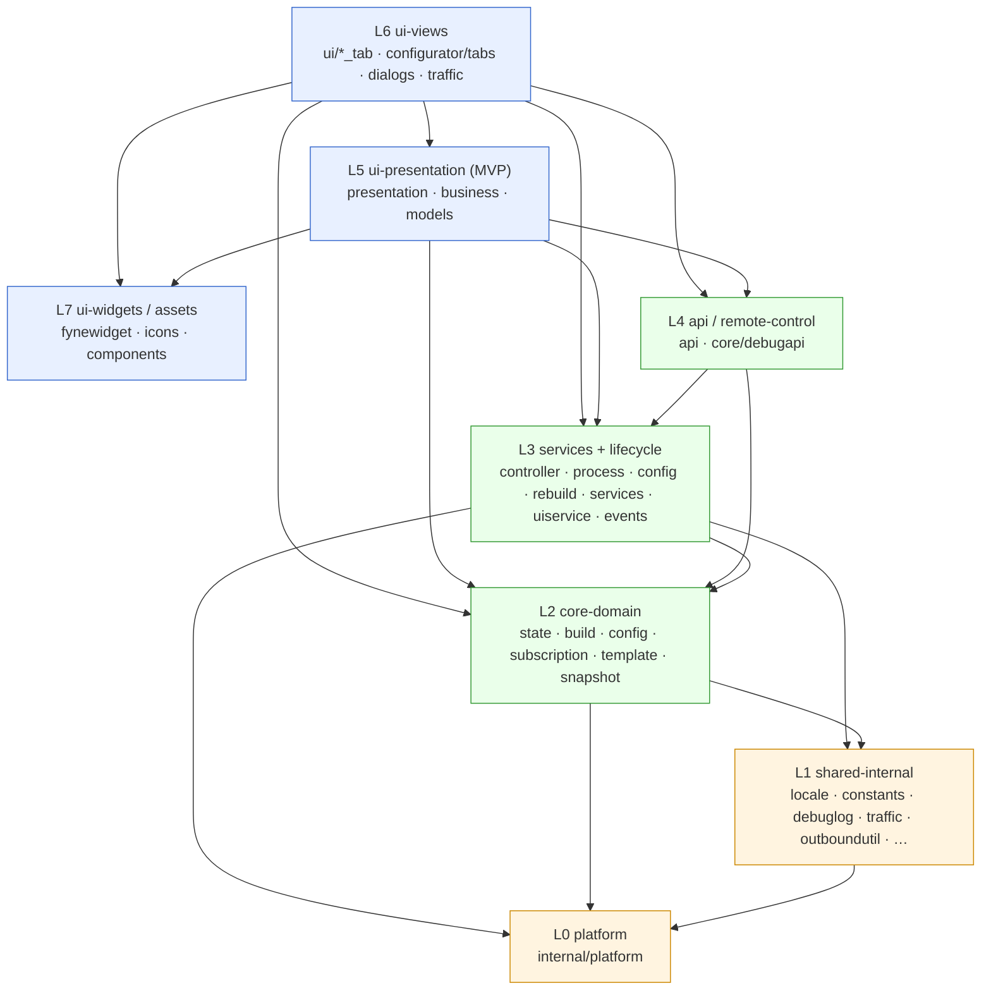

# Architecture — singbox-launcher

**🌐 Language**: English | [Русский](ARCHITECTURE.ru.md)

> Status: layer model and ADRs current as of SPEC 070 (architecture refactor &
> cleanup); §11 covers the core-engine and remote-machine seams added by SPEC
> 096–099. Branch `develop`.
> This document describes the **layer model, dependency rules, event system, state
> model, data flow, and build pipeline** of the application, plus the Architecture
> Decision Records (ADRs) that govern them.
>
> Companion documents:
> - **[ARCHITECTURE_PACKAGES.md](ARCHITECTURE_PACKAGES.md)** — per-package / per-file inventory (section 8), grouped by layer.
> - **[DATA_FLOW.md](DATA_FLOW.md)** — load / save / build / preset-toggle / edit-dialog flows (storage-time view).
> - **[WIZARD_STATE.md](WIZARD_STATE.md)** — `state.json` v6 schema.
> - **[TEMPLATE_REFERENCE.md](TEMPLATE_REFERENCE.md)** — `wizard_template.json` schema, presets, vars, `#if`.
> - **[ParserConfig.md](ParserConfig.md)** — subscription parser / share-URI reference.
> - **[API.md](API.md)** — Debug HTTP API reference.
> - **[DAEMON_AND_REMOTE.md](DAEMON_AND_REMOTE.md)** — daemon core engine, pairing, remote machines (user-facing view of §11).

---

## 1. Overview

`singbox-launcher` manages a sing-box VPN core. The **JiejieBox** macOS build is
a native menu bar app: a SwiftUI frontend (`MenuBarExtra`, no Dock icon) driving
a headless Go backend over JSON IPC. The Windows and Linux builds retain the
Fyne desktop GUI.

> **macOS frontend status.** The Fyne UI was removed for macOS. There is no
> second frontend and no runtime UI-toolkit selection: the shipped macOS app is
> the SwiftUI menu bar app, and the Go half is built with `-tags headless`, which
> drops Fyne from the binary entirely (CI fails if `fyne.io/` appears in the
> backend dependency graph). See **[MACOS_MENU_BAR.md](MACOS_MENU_BAR.md)** for
> the app guide and **[BACKEND_PROTOCOL.md](BACKEND_PROTOCOL.md)** for the IPC
> contract.

```
JiejieBox.app/Contents/MacOS/JiejieBox           SwiftUI frontend
JiejieBox.app/Contents/Helpers/jiejiebox-backend Go backend, headless
                    │
                    ▼
            sing-box core (classic child process, or daemon service)
```

The launcher downloads and pins a
sing-box binary — specifically the [`sing-box-lx`](https://github.com/Leadaxe/sing-box-lx)
fork (`constants.RequiredCoreVersion` — see `internal/constants/constants.go` for the current pin; built with the `with_xhttp` +
`with_awg` build tags and fetched from the fork's GitHub Releases; the fork builds
every platform, including the Windows 7 (`windows/386`) `legacy-windows-7` asset,
so XHTTP/AWG work there too — there is no upstream/legacy split anymore). It fetches
and parses proxy subscriptions (VLESS / VMess / Trojan /
Shadowsocks / Hysteria2 / TUIC / SSH / SOCKS / Naive / WireGuard, plus the Xray
JSON-array format, Amnezia `vpn://` profiles and pasted WG/AWG `[Interface]/[Peer]`
conf text) — including the **XHTTP** transport (`type=xhttp` for VLESS/VMess/Trojan,
parsed, generated into `config.json`, and round-tripped to share URIs) and
**AmneziaWG 2.0** on WireGuard endpoints (obfuscation params `jc`/`jmin`/`jmax`,
`s1`–`s4`, `h1`–`h4` — single values or `lo-hi` randomization ranges, CPS packets
`i1`–`i5`; AWG endpoint MTU auto-clamped to 1280) —
and assembles a working `config.json` from a user-edited **state** plus a
versioned **template**. A configuration **wizard** (the "configurator") lets users
edit subscription sources, global outbounds, routing rules, and DNS, all preview-
rendered against the same resolver pipeline the final build uses. On macOS the
wizard is reached through the Windows/Linux GUI or the Debug HTTP API; the menu
bar app links to the config file instead of embedding a configurator.

The runtime side launches and supervises the sing-box process (crash/restart state
machine, power sleep/resume handling, phantom WinTun-adapter cleanup on Windows),
talks to the running core through the Clash API (proxy list, switch, delay tests),
exposes an optional inbound Debug HTTP API for introspection/automation, and runs a
Traffic Profiler. The menu bar app surfaces the subset a menu bar needs — proxy
groups/list/switch/latency and a lightweight 1 Hz speed readout — rather than the
full profiler.

Since SPEC 096–099 the "running core" is no longer necessarily a child process on
this machine. A `CoreBackend` seam makes two engines interchangeable — *classic*
(spawn `sing-box run`, Clash HTTP) and *daemon* (macOS: the core lives inside the
long-lived `sing-box lxd` service, driven over gRPC + admin REST) — and the same
gRPC client drives **remote machines** (router, VPS, another Mac), each with its
own wizard profile, built config, deploy, traffic profiler and host-telemetry
window. See §11.

The codebase is organized into strict downward-dependency layers
(L0–L7); SPEC 070 codified those layers, removed dead code, de-duplicated leaf
helpers, and split most large monolith files — while deliberately deferring the
high-risk lifecycle/UI-controller decompositions that need GUI runtime verification.

---

## 2. Layer model (L0 → L7)

The codebase is organized into **eight layers**. The cardinal rule:

> **Imports flow downward only.** A package in layer L*n* may import packages in
> L*n* or any lower layer, but must never import a higher layer. Where a lower
> layer needs to reach "up" (e.g. domain code notifying the UI), it does so through
> an **interface** (`UIUpdater`, `ControllerFacade`, `PresetLite`) or a **callback /
> EventBus**, never a concrete import.

| Layer | Name | Packages | Responsibility |
|-------|------|----------|----------------|
| **L0** | platform | `internal/platform`, `internal/paths` | OS abstraction behind a unified interface: power sleep/wake, HWID device-info, process enumeration, WinTun ghost-adapter cleanup, canonical filesystem path getters. `internal/paths` (SPEC 135) resolves the AppDir/DataDir/LogDir layout — a package-leaf below `platform`, which imports it. Depends only on stdlib + `debuglog`/`constants`. No upward imports. |
| **L1** | shared-internal (leaf utilities) | `internal/locale`, `internal/srstag`, `internal/outboundutil`, `internal/urlsafe`, `internal/debuglog`, `internal/constants`, `internal/traffic`, `internal/textnorm`, `internal/urlredact`, `internal/ctxutil`, `internal/process`, `internal/wizardsync`, `internal/lxdclient` | Self-contained, dependency-free helpers reused across layers: i18n catalog, content-addressed SRS tag hashing, reject/drop outbound→rule mapping (single source of truth shared by core + UI), URL-scheme allowlist, leveled logging, traffic profiler (decoupled, stdlib-only), tag display normalization, URL redaction, and the mTLS client for the `sing-box lxd` daemon (pinning, invite parsing, per-machine identity — no app state). |
| **L2** | core-domain (state + build + config + template) | `core/state`, `core/snapshot`, `core/build`, `core/config`, `core/config/subscription`, `core/config/configtypes`, `core/config/parser`, `core/template` | Pure domain: state schema/load/save/migration, the JSON build pipeline and pure resolvers, subscription fetch/parse/encode and outbound generation, template load + preset extraction, snapshot capture. Pure functions where possible; **no Fyne, no `AppController`**. |
| **L3** | services + lifecycle | `core/services`, `core/uiservice`, `core/events`, `core` (`controller.go`, `process_service.go`, `config_service.go`, `rebuild.go`, `auto_update.go`, `backend*.go`, `daemon_manager*.go`, `main.go`, downloaders) | Stateful service implementations (`FileService`/`APIService`/`StateService`/`SRSDownloader`, the remote-machine registry / transport / deploy-resource collector), the UI-callback container (no Fyne deps), the typed `EventBus`, app/process lifecycle orchestration, and the `CoreBackend` engine seam (`LegacyBackend` / `DaemonBackend`). **Owns the EventBus and all DI wiring.** |
| **L4** | api / remote-control | `api`, `core/debugapi` | Outbound Clash API client (`api/`) and inbound Debug HTTP API (`core/debugapi`) that introspects/controls the app through a `ControllerFacade` interface. Both sit above domain but are reachable from services; `debugapi` talks to the controller only via an interface. |
| **L5** | ui-presentation (configurator MVP) | `ui/configurator/presentation`, `ui/configurator/business`, `ui/configurator/models`, `ui/configurator/configurator.go`, `ui/configurator/utils` | MVP layers for the wizard: **presentation** (orchestration + `fyne.Do` dispatch), **business** (pure logic behind the `UIUpdater` interface — never imports Fyne), **models** (pure `WizardModel` + slot/order containers). `business → models → core-domain`; `presentation → business`; **business never imports presentation**. |
| **L6** | ui-views (sidebar shell / dialogs / root) | `ui` (`app.go`, `navigation.go`, `home.go`, `pages.go` + `*_tab.go`), `ui/configurator/tabs`, `ui/configurator/dialogs`, `ui/configurator/outbounds_configurator`, `ui/traffic` | Fyne views: sidebar shell + content host (SPEC 144), pages (Local = proxy list + core dashboard, Remote = proxy list + machine list, then Settings / Diagnostics / Help), configurator tabs/dialogs, outbounds configurator, traffic profiler window, and the per-machine windows (add-machine, connection settings, host telemetry, resources, machine profiler). Routing is two-layered (SPEC 145): `RouteID` is the presentation route the sidebar selects, and `routeDomain` maps it to a business `SectionID`. Section switching goes through the single `App.selectSection` in `ui/navigation.go` (sidebar and the retained `AppTabs` both call it), which owns the scope → panel activation → transport → refresh order; it runs only when the domain changes, so moving between Home/Proxies/Traffic does not re-apply transport. Subscribes to EventBus / UIService callbacks; reads core-domain for rendering. |
| **L7** | ui-widgets / assets | `internal/fynewidget`, `ui/design`, `ui/icons`, `ui/components` | Reusable, self-contained Fyne building blocks and assets: hover rows, check-with-content, hover forwarding, tooltips, scroll gutter, embedded SVG icons, and the design system (`ui/design` — the application `fyne.Theme` with light/dark palettes, metrics, typography, and the sidebar/page/card/control primitives; SPEC 145). Pure Fyne composition, with no dependency on `core` (the former `click_redirect.go` exception was removed — see §3, V1). |
| **L8** | macOS backend / IPC adapter | `backend/protocol`, `backend/service`, `backend/cmd/jiejiebox-backend` | The headless macOS backend. `protocol` is the wire DTO + method/event constants (no logic); `service` wraps an `AppController` and projects its state onto that wire — core lifecycle, settings, proxies, config maintenance, traffic rate; `cmd` is the stdio entry point. Sits **above** L3 and, like every other frontend, owns no business state: it is a projection of `core`. Built with `-tags headless`, so the Fyne packages are never linked in. See [BACKEND_PROTOCOL.md](BACKEND_PROTOCOL.md). |

### Dependency diagram



ASCII fallback (arrows = allowed import direction, always downward):

```
L7  ui-widgets / assets ─────────────────────────────────┐ (reached up to by L6/L5)
L6  ui-views ────────────────► L5, L4, L3, L2, L7
L5  ui-presentation (MVP) ────► L4, L3, L2, L7
L4  api / remote-control ─────► L3, L2
L3  services + lifecycle ─────► L2, L1, L0          (owns EventBus + DI)
L2  core-domain ──────────────► L1, L0              (pure; no Fyne, no controller)
L1  shared-internal ──────────► L0
L0  platform ─────────────────► (stdlib only)
```

> **Upward escape hatches (by design, not violations):**
> - `core/debugapi` (L4) → `AppController` via the `ControllerFacade` interface.
> - `ui/configurator/business` (L5) → presentation via the `UIUpdater` interface.
> - `core/template`'s `PresetLite` interface lives in `core/state` to break a cycle.
> - L3 → L6/L5 notifications go through the EventBus and UIService callbacks.

---

## 3. Layering rules + known violations

The single rule (imports flow downward; cross-layer-up only via interface/callback)
is mostly upheld — `internal/platform`, `internal/traffic`, `internal/lxdclient` and
`api` have no upward imports; `business` never imports Fyne; `debugapi` uses a
facade. SPEC 070 codified the layers specifically so the few real violations become
visible and trackable; the SPEC 094–099 cleanup pass then closed V1 and V3.

| # | Violation | Location | Status | Designed fix |
|---|-----------|----------|--------|--------------|
| V1 | An L7 widget package imports `singbox-launcher/core` to reach `UIService.WizardWindow` for focus elevation. | `ui/components/click_redirect.go` → `core` | **Fixed** (SPEC 094–099 cleanup pass, `ce8048e`) | Done: `ClickRedirect` now takes `*uiservice.UIService` — a leaf package — instead of the whole `*core.AppController`. `ui/components` no longer imports `core` at all, which also cut `ui/traffic` from 20 transitive internal deps to 8, making its documented isolation from `AppController` factual. |
| V2 | A root main tab (L6) reaches sideways/down into the configurator package and its models (`ValidateStateID`). | `ui/core_dashboard_tab.go` → `ui/configurator` + `ui/configurator/models` | **Open** (intentional "launch wizard from dashboard"; over-broad) | Narrow to a launcher entrypoint + hoist ID validation to `core/state` (state validates its own IDs). (SPEC 070 P6) |
| V3 | `GetController()` fallback constructs a half-wired `AppController` divergent from `NewAppController`, creating two construction paths. | `core/controller.go` `GetController()` | **Fixed** (the fallback is gone) | Done: `GetController()` now just returns the singleton (nil before construction), `NewAppController` in `main()` is the only construction path, and `GetControllerOrPanic()` covers callsites that cannot proceed without it. The *field/lock extraction* half of ADR-070-7 remains deferred (§10.2). |
| V4 | Legacy `State.CustomRules`/`DNSOptions` and canonical `State.Rules`/`DNS` are kept as **parallel sources of truth** inside the domain layer (a layering-of-truth violation, not a package-edge one). | `core/state` load/sync helpers | **Open** (deferred; see ADR-070-2) | Make canonical `Rules`/`DNS` the sole stored truth; derive legacy views on-demand in the UI/business layer. |
| V5 | `StateChanged` + `ConfigBuilt` are published from L3/L5 but have **zero EventBus subscribers**, while `VpnStateChanged` uses **both** EventBus and a legacy UIService callback (`UpdateCoreStatusFunc`) — a dual-wiring inconsistency across the L3/L6 boundary. | `core/services/state_service.go`, `core/rebuild.go`, `presenter_save.go` (publishers); no subscribers | **Open** (deferred; see ADR-070-3, SPEC 047 phase 6) | Wire `ConfigBuilt`/`StateChanged` subscriptions in the dashboard and retire the parallel callbacks. |

> A CI import-graph check that enforces the L*n* → L*≤n* rule is **planned** (ADR-070-1) but not yet implemented.

---

## 4. Event system

### 4.1 The EventBus (`core/events`)

The launcher has a small, typed, **synchronous** event bus introduced in SPEC 047.

- **Typed.** Each event is an `events.Event{Kind EventKind, Payload any}`. The
  payload type is fixed per kind (`StateChangedPayload`, `ConfigBuiltPayload`,
  `VpnStateChangedPayload` in `payloads.go`).
- **Synchronous.** `Publish` invokes every subscriber's `Handler` **in the calling
  goroutine**, in order. Handlers must be cheap and must not block (no network/IO).
- **Panic-isolated.** A panicking handler is recovered so it cannot take down the
  publisher or sibling handlers.
- **`Subscribe` returns a `Cancel` closure** (idempotent) and is thread-safe; the
  handler map is guarded by an `RWMutex`.
- The concrete implementation is `MemoryBus` (`memory_bus.go`); the `AppController`
  owns the single instance (`ac.EventBus`).

```go
// usage
cancel := bus.Subscribe(events.VpnStateChanged, func(ev events.Event) {
    p := ev.Payload.(events.VpnStateChangedPayload)
    // cheap UI refresh dispatch …
})
defer cancel()

bus.Publish(events.Event{Kind: events.ConfigBuilt, Payload: events.ConfigBuiltPayload{OK: true}})
```

> **Stage A cleanup (SPEC 070, done).** The bus surface was trimmed to only the
> kinds that have a real producer or consumer. Removed: the dead `EventKind`s
> `SubscriptionUpdated`, `AutoUpdateStatus`, `PowerResume`, and the
> `ProxyActiveChanged` subscriber (it had no publisher); plus the unused
> `Bus.SubscribeAll` interface method and its `MemoryBus` "all"-subscriber slice.
> `events.go` now defines **exactly three** kinds.

### 4.2 Live event catalog

| Event | Payload | Publisher(s) | Subscriber(s) | Status |
|-------|---------|--------------|---------------|--------|
| **VpnStateChanged** | `VpnStateChangedPayload{Running, Teardown}` | `core/controller.go` (on `RunningState.Set` running-bool transition; `Teardown` says WHY when it went false) | `core/auto_update.go:71` (retry failed sources), `backend/service/backend.go` (**the menu bar backend**: republishes the core state to the SwiftUI frontend and starts/stops the traffic sampler) | **Wired on macOS** — the backend subscribes here rather than only emitting after a command, so the menu bar follows the core when it dies on its own. |
| **ConfigBuilt** | `ConfigBuiltPayload{OK bool}` | `core/rebuild.go:188` (OK=false on check failure), `core/rebuild.go:221` (OK=true on successful write+validate) | **none** | **Dead-subscribe** — published, never consumed via the bus. Config-status UI is currently driven by the `UpdateConfigStatusFunc` callback instead. |
| **StateChanged** | `StateChangedPayload` | `core/services/state_service.go:207` (dirty-marker mutations), `ui/configurator/presentation/presenter_save.go:174` (on Configurator Save) | **none** | **Dead-subscribe** — published, never consumed via the bus. |

### 4.3 UI callbacks (Fyne builds only)

On Windows and Linux, `internal/uiport` holds the callback interface the Fyne UI
implements; `core` calls it through a nil-safe accessor that falls back to a
no-op implementation when no UI is attached. On macOS the headless backend
implements the same port as a no-op, which is what lets `core` stay unchanged
across frontends instead of growing conditionals.

| Callback | Role | Migration direction |
|----------|------|---------------------|
| `UpdateCoreStatus` | VPN-state refresh (Start/Stop/Restart button states) | The macOS backend subscribes to `VpnStateChanged` instead. |
| `UpdateConfigStatus` | Config-status label / dirty markers | Replace with a `ConfigBuilt` subscription. |
| `ReportParserProgress` / `ReportSubsResult` | Multi-shot subscription progress + final result | **Keep** — multi-shot progress; could become a typed event later (low priority). |
| `RefreshProxyList` / `ResetAPIState` / `AutoPingAfterConnect` | Clash-API refresh/reset/auto-ping wiring | **Keep** — the menu bar drives proxies over IPC on top of the same services. |

> **Migration direction (ADR-070-3).** The target is: `VpnStateChanged`,
> `ConfigBuilt`, and `StateChanged` are delivered **exclusively** through the
> EventBus, and the callback port shrinks further. On macOS that consolidation is
> done for `VpnStateChanged`; the Fyne builds still dual-wire it.

---

## 5. State model

### 5.1 Current reality: canonical-v6 + legacy projection (dual-state)

`core/state.State` currently carries **two parallel views** of the same data:

- **Canonical v6 fields:** `Connections` (sources / outbounds / defaults),
  `Rules[]` (kind = preset / inline / srs), and `DNS` (flat `servers[]` / `rules[]`
  with a kind discriminator). This is what `Save` writes to disk (`meta.version = 6`,
  `schema = presets_v1`).
- **Legacy view:** `ParserConfig` (proxies), `CustomRules`, `DNSOptions`,
  `SelectableRuleStates`. These mirror the canonical data for backward-compat UI
  paths that still read the legacy shape.

The two views are kept in sync by **adapters**:

- On **Save**: `syncConnectionsFromLegacy` (`sync_to_connections.go`) copies
  `ParserConfig.Outbounds → Connections.Outbounds` (the "synced" version wins).
- On **Load**: `syncLegacyFromConnections` (`sync_to_legacy.go`) fills `ParserConfig`
  from `Connections`; `legacyCustomRulesFromV6` (in `load_v6.go`) derives
  `CustomRules` from `Rules`.
- For headless `Load → mutate → Save` paths (auto-update, log-level, config_service),
  `deriveV6FromLegacy` (in `load_v5.go` / `load_v2_v3_v4.go`) backfills empty
  canonical `Rules`/`DNS` from the legacy view — the **"BUG1" workaround**.

**The dual-state problem.** Because both views are stored and runtime-backfilled,
headless paths that mutate one view without re-emitting from the configurator can
diverge from the UI. `deriveV6FromLegacy` and `legacyCustomRulesFromV6` exist purely
to paper over having two sources of truth. (This is layering-violation **V4** above.)

### 5.2 Designed target (ADR-070-2) — not yet implemented

`core/state.State` stores **only** canonical `Rules`/`DNS`/`Connections`. Legacy
`CustomRules`/`DNSOptions`/`ParserConfig.Proxies` become **on-demand projections**
computed in the UI/business layer (e.g. a `wizardmodels` helper), not fields on
`State` and not runtime-backfilled. The bidirectional adapter survives **only** as a
read-time migration shim for old (v2–v5) disk files. Once the UI Rules/DNS tabs read
canonical fields directly, `deriveV6FromLegacy`, `legacyCustomRulesFromV6`, and
`State.CustomRules`/`DNSOptions`/`SelectableRuleStates` can be deleted.

> **Accurate status:** dual-state is **still present**. The schema *write path* is
> already single (canonical v6 only, since SPEC 060 removed dual-write); what remains
> is removing the in-memory legacy fields and runtime backfill. Deferred to SPEC 070
> P6 (see §10) because it requires migrating the UI Rules/DNS/source tabs and
> verifying every headless callsite under the GUI runtime.
>
> **Reversion note:** the elimination was actually landed once (commit `43a5f11`,
> canonical v6 as the sole stored truth) and then **reverted** (`a58a176`) after a
> GUI round-trip test surfaced a DNS-save regression. The approach is sound but
> re-landing requires supervised GUI save/load verification of the Rules/DNS/source
> tabs — hence it remains deferred and documented rather than in-flight.

### 5.3 On-disk schema migration

`Load` parses any v2..v6 disk shape and normalizes forward to the canonical
in-memory `State`; `Save` always writes v6. Schema detection routes to per-version
parsers (`load_router.go` → `load_v6.go` / `load_v5.go` / `load_v2_v3_v4.go`), each
followed by a shared `normalizeAfterLoad` (`load_normalize.go`). See
[WIZARD_STATE.md](WIZARD_STATE.md) for the full schema.

---

## 6. Data flow

The launcher has two driving flows: **ingest** (subscription → nodes → state →
config) and **UI edit** (wizard → state → rebuild). Both converge on a single config
writer. (For the storage-time view with diagrams, see [DATA_FLOW.md](DATA_FLOW.md).)

### 6.0 Node flow: three stages from text to body (SPEC 131)

Whatever a node arrives as — a share link, a hand-written JSON object, a
subscription body, a WireGuard `.conf`, a backup entry or a form edit — its
**body** is produced by exactly one sequence:

```
text ──▶ 1. mapper ──▶ 2. sanitizer ──▶ 3. emitter ──▶ state.Node{Body, Warnings[]}
         (dialect)     (registry rules)   (table)                    │
                                                                     ▼  build
                                                      core/platform gate ──▶ config.json
```

1. **Mapper** (`core/config/linkmap`, driven by the `contract/registry/**/mappers.*`
   tables) translates a dialect into the canonical sing-box shape:
   `sni`→`tls.server_name`, `?ed=N`→`max_early_data`, Xray
   `streamSettings.*`→`transport.*`. **Which** value goes **where** is declared by
   the registry, not written in Go: there is no scheme or protocol name in the
   engine, because every such name would be a second copy of a rule that already
   exists as data. It decides nothing about *values*; its only refusals are "form
   not recognised" and "syntax unparseable". Architecture —
   `contract/docs/MAPPER_ENGINE.md`.
2. **Sanitizer** (`core/config/nodeflow.Sanitize`) applies the rules of
   `contract/registry/**` — type, enum, format, per-scheme bans, conflicts,
   unknown keys. Anything removed or coerced produces a `{code, path}` warning.
   The code knows no protocol by name; every scheme-specific difference is data.
3. **Emitter** (`core/config/nodeflow.Emit`) walks the registry's field order and
   writes what the sanitizer left. No per-scheme branching and no type asserts —
   the values are already coerced.

`core/config.materializeBody` is the single entry point to that sequence, and
`state.Node.Body` is only ever written from its output.

Two properties fall out of this, and both are load-bearing:

- **A value the core rejects fatally cannot reach a body.** sing-box refuses a
  `config.json` *whole* on one bad field, so a single bad node from a
  500-node subscription would otherwise leave the user with no VPN at all.
  `TestCorpusBodiesPassSingboxCheck` enforces this by assembling every corpus
  case into one config and running the pinned core's `check`.
- **The body is frozen; the core is not.** A body carries the fields of whatever
  core wrote it, so the version/platform gate (`nodeflow.GateForCore`, driven by
  `min_core`/`platform` in the registry) runs at *build* time and omits keys the
  target core does not know. The node stays; only the runtime is narrowed, so no
  ⚠ is raised. The node-level gate is a different class: it drops the whole
  node before emission. It is table-driven too (`nodeflow.NodeCoreRefusal`):
  a protocol body, a field or a range form (`range_form`) that declares
  `on_core_unsupported: drop_node` names its requirement (`build_tag`/
  `min_core`) and code; the app layer only supplies the core's build tags
  (`config.CoreBuildTagsProbe`, from `sing-box version`) and version. Dropped
  nodes travel as `OutboundGenerationResult.CoreSkips` into the build report
  (`core_unsupported`). Chains keep their own gate (`ChainSupportProbe`).

SPEC 142 removed the last hand-written per-scheme rules about node fields from
Go; every such rule is now registry data, read by the same three-stage engine
above, and `TestRegistryCodeRefsResolve` (`core/config/registry_refs_test.go`)
keeps the registry's own pointers to code (`refs.go`, `impl`/`go`/`note`)
truthful — it fails the Contract CI job on any `.go` change if a referenced
file or identifier no longer exists. Two attributes and two post-walk
primitives came out of that work:

- **Field role** (`role: credential | private_key`, top-level body fields
  only) — `registry.FieldWithRole` finds a node's account secret
  (UUID/password/username slot) and its private-key field by role instead of
  a per-scheme table, so link and JSON inputs agree on what goes in the
  userinfo slot and which share links need a "contains a private key"
  confirmation.
- **Field allowed on a body** — `registry.Registry.FieldAllowedOn` answers
  "would the sanitizer keep this field in this finished body" (scheme gate plus
  every `conflicts` relation with its `when`/`unless_set`). Code that writes
  fields after the sanitizer — the build's global anti-DPI TLS transforms
  (`core/build/tls_transforms.go`) — asks it per node, so MASQUE on
  `vhttp: h3` gets no TLS fragmentation (contract 1.1.64).
- **Fields yielding to a build-written field** — `registry.Registry.YieldsTo`
  is the other side of the same question: which fields of a finished body the
  sanitizer would drop by a `conflicts {with}` relation if the managed
  neighbour `with` had been present during the walk. `detour` is written by
  the build after the sanitizer (`ApplyCanonicalNodeLinks` →
  `resolveCanonicalDetour`), so right after it is set
  `yieldToBuildDetour` drops the yielding fields with the relation's code into
  the build report — WireGuard `listen_port` gives way to `detour`
  (`detour_with_listen_port`), `tls.fragment` too (`detour_with_tls_fragment`,
  contract 1.1.84); the detour itself stays (fail-closed). No
  scheme names in code (contract 1.1.65). A materialised node is emitted
  from its frozen `EmitBody`, so the removal itself happens where `detour`
  meets the body — `stampTagAndDetour` → `yieldBodyToDetour` — for
  Directions and chain owners alike (chains log it via `yieldChainDetour`).
  During the sanitizer walk a managed field counts as absent for relations:
  a `detour` that arrived in the input never reaches the core and must not
  drop a neighbour.
- **`requires[].set`** — a missing required neighbour is *materialised* (with
  a warning code) instead of the field being dropped, and **`coerce_when`** —
  a field's already-valid value is replaced under a condition (also coded).
  Both are judged on the finished body after the sanitizer's normal walk
  (`deferred`, mode `final`), which is how REALITY↔uTLS became one registry
  rule instead of a build-time patch (`nodeflow.NodeCoreRefusal`'s sibling for
  values). Bodies the build does not run through the sanitizer — frozen state
  bodies, manual `config_json` — still get these two as repairs via
  `nodeflow.Repairs`, with the code going to the log instead of a stored
  warning.

Warnings are derived data — recomputable from `origin.raw` — and are stored only
so the UI can draw ⚠ without re-parsing. `nil` means "never counted" and an empty
list means "counted, clean"; a one-time pass at load turns the former into the
latter for nodes saved before the pipeline existed.

### 6.1 Ingest → state → build → config.json → run

1. **INGEST (subscription → nodes).** UI/auto-update triggers
   `config_service.UpdateConfigFromSubscriptions` → `refreshOneSubscriptionSource` →
   `fetcher.FetchSubscriptionWithMetaFor` (HTTP GET with HWID/UA headers, max 10 MB,
   announce-header decode) → `decoder.DecodeSubscriptionContent` (base64 strip) →
   `config.MaterializeSubscriptionBody` → `subscription.ParseSubscriptionBody`
   (the only body parser); `subscription.ClassifySubscriptionBody` picks one of
   three branches:
   - **URI list** — `subscription.ParseNode` per line, which hands the raw text to
     the registry engine (`core/config/linkmap`): the section is chosen by the
     registry's `detect`, its table builds the sing-box body. Two branches stand
     beside the engine: the Amnezia `vpn://` profile, and "scheme not supported"
     for text no section recognises;
   - **Xray JSON array** — `ParseNodesFromXrayJSONArray`;
   - **sing-box JSON** (single outbound / outbound array / whole config / config
     array, SPEC 094) — `ParseSingboxBody`: `outbounds` + `endpoints` are read as
     one list, service types (`direct`/`block`/`dns`) are skipped, `detour` chains
     are resolved up to 8 hops with cycle detection, `selector`/`urltest` become
     the source's local outbounds, and `route`/`dns`/`inbounds`/`experimental` are
     ignored by design (reported back for the UI).

   Then skip-filter + dedup + raw-tag uniquification → `Subscription.nodes[]`;
   tag prefix/postfix is applied later, at emission (`EmitCanonicalSource`).

   **Local file import** (`service.ImportSubscriptionFile`) enters this same
   pipeline at `DecodeSubscriptionContent` and differs only in where the bytes
   come from — no fetcher, no network, otherwise identical. The resulting source
   is saved with `kind: subscription` and `input_kind: local_snapshot`, an empty
   URL and `local_filename` set, so it is a self-contained snapshot: deleting the
   original file does not affect it. Refreshability is answered in exactly one
   place, `state.CanRefreshSubscription` (manual Refresh, Update All,
   auto-update and warm-up all consult it), because a per-site `url != ""` test
   would send a local snapshot to the network with an empty URL and report a
   provider error the user never caused. Local snapshots otherwise behave like
   any source: their nodes are emitted into the config normally. Legacy records
   with no `input_kind` read as `remote`; no migration is involved. See
   [IMPORT_FLOW_AUDIT.md](IMPORT_FLOW_AUDIT.md).

### 6.1a Custom core import

`service.ImportCoreFile` installs a user-selected sing-box binary as the Data
core. It is deliberately a transaction whose destination is untouched until the
candidate is fully verified:

```
validate path (regular file, ≤ 256 MiB)
  → platform support (darwin only; CoreImportSupported())
  → core settled-stopped (not merely "not running")
  → Mach-O architecture via debug/macho (fat slice or thin; never `file`)
  → no SINGBOX_LAUNCHER_CORE override shadowing the Data core
  → selected path is not the installed path
  → stage a copy BESIDE the target (a temp file, then Sync)
  → probe `<staged> version` (3 s) must parse a version banner
  → `<staged> check -c config.json` (5 s) must accept the current config
  → os.Rename over the target (atomic: same directory, one filesystem)
  → InvalidateCoreBinaryCaches() + FileService.ResolveCore()
```

Every step before the rename returns an error with the old binary untouched, and
the tests assert that byte-for-byte (SHA-256 before/after) for each rejection
class. Two orderings are load-bearing: the architecture check runs before the
same-path check, and the override check runs after validation so the user gets the
more specific reason when both apply. Off macOS `CoreImportSupported()` is false,
so the capability block never advertises an action the backend cannot perform.

`InvalidateCoreBinaryCaches` is required rather than merely tidy:
`installedCoreVersionCache` is session-lifetime and does **not** self-expire on an
mtime change, so without it the UI would report the previous version for the rest
of the session after a successful swap.

   An imported `selector`/`urltest` becomes a **node** with scheme `group`
   (`configtypes.SchemeGroup`), sitting in the same list as regular nodes. It has
   no privileges: it never enters the wizard's Directions tab, routing rules do
   not reference it, and its membership is not user-editable. That tab stays
   reserved for the launcher's own **channels**, which do drive routing. For
   sing-box the node still emits as a real selector/urltest inside `outbounds`
   (`generateGroupNodeJSON`).

   `ParseSubscriptionBody` returns a `ParsedBody` — entries (groups included, with
   members resolved to raw tags) plus the config sections the parser deliberately
   ignores.

   Within a single source, nodes are deduplicated by identity (SPEC 094 D3)
   **before** tags are assigned, otherwise `MakeTagUnique` would hand a duplicate
   a `…-2` tag first. Identity is `config.NodeIdentityHash`: sha256 over the
   emitted outbound JSON with `tag` and `detour` removed and keys sorted. The
   emitter lives in `config` while the parser lives in `subscription`, so the
   dependency is injected top-down via `subscription.NodeIdentityHashFunc` (wired
   in `core/controller.go`) — the same pattern as `LookupCachedBody`, and for the
   same reason: a direct call would close an import cycle. With the hook unset the
   parser still works, it simply does not deduplicate.
2. **CACHE.** Per-source raw body written atomically via `state.WriteRawBody`
   (`.tmp` + `Sync` + `Rename`); outbound JSON produced by
   `config.GenerateOutboundsFromParserConfig` (three passes: `buildOutboundsInfo` →
   `computeOutboundValidity` topological sort → `generateSelectorJSONs`) → `[]string`
   held in `BuildContext.Cache`. `ClearCacheStale` + `MarkConfigStale` set.
3. **STATE WRITE.** `config_service` mutates the `*State` subscription `Meta`, then
   `state.Save` → `syncConnectionsFromLegacy` → `marshalDisk` (v6 layout) → atomic
   write. **`config.json` is NOT written here.**
4. **BUILD (state → sing-box config).** `rebuild.RebuildConfigIfDirty` (the sole
   `config.json` writer; noop fast-path when clean and not forced) →
   `config_service.buildContextFromState` assembles
   `BuildContext{Template, Vars, Cache, DNS, Route, Preset}` → `build.BuildConfig`
   (pure) dispatches per section: `BuildOutboundsSection`,
   `MergeDNSSection → MergePresetsIntoDNS (ResolveDNS)`,
   `MergeRouteSection → MergePresetsIntoRoute (ResolveRoute → ExpandPreset per
   preset-ref)` → concat final JSON → `atomicWriteConfig(ConfigPath, …)`.
5. **RUN.** User Connect → `ProcessService.Start` → `RebuildConfigIfDirty` pre-start
   hook (applies Wizard-Save dirty markers, SPEC 068) → launch sing-box + `Monitor`
   goroutine → `RunningState.Set(true)` → publish `VpnStateChanged` → auto_update
   retry + `ui/app` sidebar status refresh + auto-ping arm.

### 6.2 UI edit → state → rebuild

User edits the `WizardModel` (Sources / GlobalOutbounds / Rules / DNS) in the
configurator tabs → presenter syncs GUI → model (`ReconcileRuleOrder`,
`SyncRulesByOrderToStateRulesV6`, `SyncDNSByOrderToState`) on Save → `presenter_save`
validates → `state.Save` (v6) → publish `StateChanged` + auto-`RebuildConfigIfDirty`
→ success dialog. The next Start re-applies via the pre-start rebuild hook.

### 6.2.1 config.json → node details in the UI (SPEC 095)

The Servers list is driven by `api.ProxyInfo` from the Clash API, which carries
only `Name`, `ClashType`, `Delay` and `Traffic` — no transport, no TLS, no group
membership. Everything the UI shows beyond a tag and a latency therefore comes
from the generated `config.json`, read back through
`ui/configurator/business.LoadConfigNodes` → `ConfigNodes.Lookup(tag)`.

That read-back feeds the row subtitle (`vless·tcp·Reality+Vision`), the group
mode badge (`⚖️ [37]` for `mode: round_robin`, `🎯 [11]` otherwise) and the Info
window. A tag missing from the config is not an error — the Clash API can report
a node from a config that has since been regenerated — and the UI simply omits
the detail.

The source Preview tab needs the same detail **before** any config exists: the
subscription has only just been parsed and not yet saved. It therefore reads
straight from `ParsedNode` via a parallel pair of files
(`ui/configurator/tabs/preview_node_subtitle.go`, `preview_node_info.go`).

### 6.3 The single-writer invariant (ADR-070-4)

> **`config.json` has exactly one writer: `rebuild.RebuildConfigIfDirty`.**
> Verified in code: `RebuildConfigIfDirty` is the only function that calls
> `atomicWriteConfig(ac.FileService.ConfigPath, …)` (`core/rebuild.go:170`).
> `Start()` rebuilds before launching sing-box (pre-start hook); `Update()`
> auto-rebuilds on cache success; `RebuildConfigIfDirty` noop-skips when clean and
> not forced. Neither `Start` nor `Update` writes `config.json` directly. This
> invariant prevents stale-config-on-start regressions and is the anchor of the
> Start/Build/Save state machine.
>
> **Serialization.** Because a rebuild is a read-modify-write on one file,
> `AppController.buildMu` (`core/controller.go`) makes it exclusive. Two
> concurrent builds could otherwise promote candidates out of order and leave a
> config rendered from a stale state snapshot. It is a mutex, not a busy flag: a
> second caller waits for a correct config rather than being refused one. It is
> acquired first and never held while another launcher lock is taken, so it cannot
> invert with `CmdMutex`.

---

### 6.3a Classic runtime lifecycle (`core/classic_runtime.go`)

The privileged-child lifecycle is owned by a single mutex-guarded state rather
than by independent booleans read and written from different goroutines.

```
stopped ──beginOperation──▶ starting ──readiness window survived──▶ running
   ▲                            │                                      │
   │                            └── early exit ──▶ failed              │
   └──────── terminate confirmed ── stopping ◀──────────────────────────┘
```

- **Every operation carries a generation.** `isCurrent(gen)` gates every state
  write, so a superseded goroutine cannot change the phase, clear ownership or
  touch the crash counter. `beginOperation` refuses a start while one is in
  flight — concurrent starts are impossible by construction.
- **A generation is a PARAMETER, never a lookup.** A handler that reads
  `currentGeneration()` and then checks `isCurrent()` on that same value has a
  guard that is true by construction and can never fire; this exact tautology
  existed in `onPrivilegedScriptExited` and let a dead generation write ownership
  and phase for the live one. Callbacks take the generation they belong to.
- **Crash classification is scoped to its own generation.** The core log is
  append-only across generations, so a fatal signature from a previous core could
  be read as the current exit's cause and stop auto-restart for an unrelated
  transient crash. Each generation records the log offset at start, and
  classification reads only what follows.
- **Readiness.** `exec.Start` succeeding means a process exists, not that the VPN
  is up. The phase stays `starting` until the process survives a bounded window;
  a death inside it is a failed START with a classified reason, not a crash.
- **A timeout must be able to interrupt the wait it is timing.** The operation
  deadline bounded nothing while the waits that actually take the time — the
  template refresh, `CmdMutex`, the daemon's `applyMu`, and the daemon RPCs
  themselves — could not be cancelled. `acquireWithContext` provides a
  cancellable mutex acquisition; ownership is decided by a single buffered send so
  there is no window where both sides wait and none where neither releases. Go
  treats `sync: unlock of unlocked mutex` as an unrecoverable `fatal error`, so
  the helper is tested directly under `-race` rather than argued about.
- **No `defer Unlock` where a lock is released mid-body.** `Monitor` and
  `onPrivilegedScriptExited` release `CmdMutex` before a delay and then re-acquire
  it. Mixing that with a deferred `Unlock` produced an unrecoverable
  `fatal error: sync: unlock of unlocked mutex` twice, because every early return
  after the manual release had to remember not to unlock again. Both use explicit
  accounting now (no defer), as `KillForRestart`/`ForceStopOwnedCore` always have.
  `TestNoDeferredUnlockWhereTheLockIsReleasedMidBody` asserts the shape.
- **Confirmed termination** (`core/terminate.go`): TERM → wait → KILL → confirm,
  with the process identity (executable path) verified on every probe so a
  recycled PID is never signalled. One primitive for every kill path.
- **Adoption.** A core inherited from a previous session is not a child, so
  `watchAdoptedCore` polls its existence (identity-verified) and corrects the
  state on death. Adoption refuses a PID whose executable cannot be verified.

### 6.3a-bis Operation state machine (`backend/service/core_operation.go`)

The IPC layer records an in-flight start/stop/restart as an explicit operation
rather than inferring one from a boolean plus a kind string plus a late callback.

- **The invariant is "an old operation has no authority over the new world".**
  Every operation carries an id; `finishOp` compares it against the current record
  and a mismatch is a TOTAL no-op — it cannot reach the error store or publish
  state. `beginOp` marks the outgoing operation superseded *and* cancels its
  context under the same lock, so the flag and the cancel are both visible before
  the new record is.
- **Waiting is not succeeding.** `runCoreOp` returns the real outcome, and the UI
  shows `starting` from the moment the request is accepted (the accepted-request
  record covers the window before the runtime records anything).
- **An operation must reach a terminal state without depending on one event.**
  A stop is settled by the runtime transition *or* by its own contextual call
  returning success. `RunningState.Set` dedups a no-op write, so a stop completing
  while the flag is already false publishes no event at all; depending on that
  event alone left the record at `stopping` forever.
- **A transition carries WHY it happened.** `Running == false` is produced by a
  user stop, a restart's teardown, a crash and an engine switch, and they need
  opposite responses. `VpnStateChangedPayload.Teardown` distinguishes them, and
  only a deliberate user stop ends a stop operation: a restart's teardown reported
  as a completed stop was confirmed moments before a new core appeared.

### 6.3a-ter Ownership is the source of truth for liveness
(`core/classic_runtime.go`, `backend/service/backend.go`)

`RunningState` is a BELIEF updated at transitions and can be false while a process
is alive (the crash path clears it as soon as an exit is observed, and a process
can outlive that observation). Ownership — the record of what this launcher
launched and has not confirmed dead — is the honest answer to "is a core of ours
running", and two things depend on it:

- the reported lifecycle state consults ownership, so a live owned core is never
  reported as `stopped` (the phase is not a statement about processes existing: an
  adopted root core records its identity without passing through any start
  operation);
- closing an engine stops what it still owns before renewing the generation.
  Renewing only invalidates bookkeeping and kills nothing, so an engine switch
  after a crash could otherwise leave a live core holding the TUN while the new
  engine's core started beside it.

### 6.3b Lifecycle errors (`core/lifecycle_error.go`)

One store — `(code, operation, message, detail, recoverable, config_error)` —
holds why the runtime is not working. It is read by `coreState()` in
`backend/service`, so a failure reaches the frontend both live (through the
already-bridged state event) and in the snapshot, surviving a GUI restart.

Producers: the rebuild path, `showErrorUI` (covering every existing caller), the
deterministic-exit and restart-exhausted paths, the privileged-copy gate, and the
daemon apply/FATAL/stop paths. Retryability is decided at the source: an occupied
port, missing permissions, a cancelled authorization and a refused config are
deterministic and are not advertised as retryable.

### 6.3c Reference integrity (`core/build/ref_integrity.go`)

After assembly, `finalizeReferences` resolves every reference the core will
resolve — `outbounds[*].detour`, group members, `route.rules[*].outbound`,
`route.final`, `dns.servers[*].detour`, `dns.rules[*].server`,
`route.default_domain_resolver`, `route.rules[*].rule_set`. A dangling reference
is an `ErrInvalidInputs` (caught at build time), and a dangling `route.final` is
repaired to the first declared group that can carry traffic, then a direct
outbound, then refused. The choice is by declaration order, never map order.

`domain_resolver` is a DNS **server** tag, not an outbound, and is validated in a
second pass so forward references stay legal. Validation is skipped for previews
(an incomplete draft) and for a config with no outbounds at all (the lx-only
template). Decoding goes through `jsonc.ToJSON`: every generated config contains
`//` comments, so plain `encoding/json` fails on every real config.

---

## 7. Build / config pipeline

The build pipeline is a **pure resolver pipeline** (ADR-070-5): impure concerns
(network fetch, state I/O, UI signaling) live in `config_service`/`services`, and the
actual JSON assembly is a pure function over an explicit `BuildContext`.

```
state.json (+ per-source .raw cache)  +  wizard_template.json
            │
            ▼
config_service.buildContextFromState
            │   assembles BuildContext{Template, Vars, Cache, DNS, Route, Preset}
            ▼
build.BuildConfig  (pure)
            │
            ├─► sanitizeOutboundGraph  (final dependency-graph pass)
            │      one walk over ALL edge kinds (group member / detour / chain
            │      position): dangling refs, cross-edge cycles, chain invariants
            │      («nested chain only at position 0») — degrade one element with
            │      a warning instead of letting the core reject the whole config
            │
            ├─► BuildOutboundsSection / BuildEndpointsSection
            │      (consume BuildContext.Cache = GenerateOutboundsFromParserConfig output)
            │
            ├─► MergeDNSSection → MergePresetsIntoDNS → ResolveDNS (pure)
            │      walk state.DNS kind switch (template / preset / user),
            │      attach metadata (Source / Required / Locked / Active / Enabled)
            │
            └─► MergeRouteSection → MergePresetsIntoRoute → ResolveRoute (pure)
                   walk state.Rules kind switch (preset / inline / srs),
                   ExpandPreset per preset-ref (canonical @var walker, eval if/if_or,
                   prefix tags, clean dangling rule_set refs)
            │
            ▼
concat final JSON → atomicWriteConfig(config.json)
```

Key properties:

- **`BuildContext` is the seam.** Everything `BuildConfig` needs is captured in the
  context struct; the function performs no I/O. The `Preset.ExecDir` invariant (set
  by the context builder) is required for SRS local-path resolution.
- **One resolved view for UI and build.** `ResolveDNS` / `ResolveRoute` (and the
  per-entry outbound resolver) are the single source of truth consumed by **both**
  the wizard's preview rendering and the final emit — so preview never diverges from
  the written config.
- **`ExpandPreset` is single-sourced.** Both `ResolveRoute` and `ResolveDNS` call it
  once and consume the result; `evalIf` / if-filtering live in one place
  (`preset_expand.go`, unified in SPEC 070 cleanup Stage 3b).
- **One template walker (SPEC 143).** Every `@var` / `#if` substitution goes
  through the canonical walker `template.SubstituteVarsInJSONCanonWarnings`
  (`core/template/substitute_canon.go`, rules of `contract/docs/TEMPLATE_LANG.md`):
  the main config (`ApplyTemplateWithVarsForWarnings` /
  `GetEffectiveConfigForWarnings`), `on_change.set` (`EvalIfScalar`), preset
  bodies (`substitutePresetBody`, which declares all template vars plus the
  preset's own, so an empty global drops the key instead of leaking `"@name"`)
  and template DNS servers (`substituteTemplateDNSServer`). The old lenient and
  strict walkers and the hard-coded list of numeric var names are gone: a value
  becomes a number only by its declared `type: int` (`template.CastIntValue`,
  clamp [0, 65535], a non-number stays a string with a warning; the same cast
  serves `@var` in `parser_config` via `core/config/varsubst.go`). After the
  Dropped cascade validity gates run in one place, `preset_expand.go` (preset
  fragments and template DNS servers alike): a route rule without `outbound`/`action`, a DNS rule without
  `server`/`action`, a `rule_set` without a source, a DNS server without an
  address or a rule without conditions is dropped with
  `template_fragment_dropped`.
- **Template warnings reach the build report.** The walker returns
  `[]TemplateWarning{Code, Params}` (deduplicated by code + params):
  `template_var_undeclared`, `template_unknown_directive`,
  `template_int_clamped`, `template_int_invalid`, plus
  `template_fragment_dropped` from the gates. The build collects those of the
  main config, presets and DNS servers into `build.Result.TemplateWarnings`;
  `core.FeedBuildReportFromTemplate` (called in `core/rebuild.go` and
  `ui/configurator/business/create_config.go`, next to the sanitizer feed) turns
  each into a `template_degraded` entry, which goes **first** in the Summary: a
  broken setting explains everything below it. Text comes from
  `contract/registry/warnings.json` by code; nothing blocks Save. Warnings of
  `on_change.set` (UI edit, no build running) and of the `parser_config`
  substitution go to the log only.
- **Outbound JSON generation** was split out of the 1086-LOC monolith into
  `outbound_validity.go` (the three-pass algorithm), `outbound_jsonbuilder.go`
  (the `JSONBuilder` that appends fields in insertion order, replacing the fragile
  `fmt.Sprintf` + `strings.Join` pattern), and `outbound_filter.go`. The
  `JSONBuilder` is **partially adopted** — the full migration of every protocol
  generator onto it is deferred (see §10).
- **Root sections without a handler pass through.** A template `config` section
  with no dedicated builder (`log`, `certificate`, `experimental`, the fork's root
  `lx` block) is emitted as-is after `@var` / `#if` substitution. This is the only
  channel for `lx.masque.idle_timeout` (core ≥ lx.13; the template may carry `lx`
  only together with that pin, lx.12 rejects the unknown root key). There is no UI
  for it. The launcher never emits the WireGuard idle-suspend keys in either form
  (`route.lx_idle_*`, `lx.wg.*`): desktop core builds lack `with_lx_idle_suspend`
  and refuse them at start (SPEC 138; pinned by `TestBuildConfigPassesRootLXBlock`).

See [DATA_FLOW.md §3](DATA_FLOW.md) for the build flow with the SPEC 057/058 outbound
`Ref`/`Updates` resolution detail.

---

## 7a. Data directory layout (SPEC 135)

Before SPEC 135 every path derived from one root, `FileService.ExecDir =
filepath.Dir(os.Executable())`: on a read-only install (NixOS, Guix, Flatpak,
`/opt`) `EnsureDirectories` failed on the first `MkdirAll`, and on macOS all state
lived **inside the `.app` bundle**, so replacing it wiped user data. SPEC 135
replaces the single root with three roles, computed once and passed by value —
never a package-level global or lazy re-derivation:

| Role | Type | Rights | Holds |
|---|---|---|---|
| **AppDir** | `paths.AppDir` | read-only | the executable, the shipped template + locales (`bin/wizard_template.json`, `bin/wizard_template.version`, `bin/locale/`), the shipped core + companions if bundled, `mesa3d/`, the `portable.txt` marker |
| **DataDir** | `paths.DataDir` | read-write | all state and caches, in the pre-existing internal `bin/…` layout (state, snapshots, remote-machine profiles, `config.json`, downloaded template/locales/core, `.srs`, subscriptions, `settings.json`, `gl-state.json`, `wintun.dll`, `tailscale/`, `daemon/`, `remote-daemons/`) |
| **LogDir** | `paths.LogDir` | read-write | the four rotated logs, `crash.log`, `native-stderr.log` |

The only sanctioned write into AppDir is the Windows Mesa3D toggle
(`internal/platform/glstate.go` `DisableMesa`/`EnableMesa`): `opengl32.dll` must
sit next to the exe for the OS loader to find it. The Mesa buttons in Diagnostics
are hidden when AppDir does not pass the write probe.

### 7a.1 Paths per platform

| Platform | AppDir | DataDir | LogDir |
|---|---|---|---|
| Linux | executable's directory | `$XDG_DATA_HOME/singbox-launcher` (default `~/.local/share/singbox-launcher`) | `$XDG_STATE_HOME/singbox-launcher/logs` (default `~/.local/state/…`) |
| macOS, launched from `.app` | `…app/Contents/MacOS` | `~/Library/Application Support/singbox-launcher` | `~/Library/Logs/singbox-launcher` |
| macOS, bare binary | executable's directory | = AppDir (portable) | `AppDir/logs` |
| Windows | exe's directory | `%LOCALAPPDATA%\singbox-launcher` | `%LOCALAPPDATA%\singbox-launcher\logs` |
| Any platform, portable | executable's directory | = AppDir | `AppDir/logs` |

The executable's directory is taken **after** `filepath.EvalSymlinks` (Homebrew and
`/nix/store` install symlinks); an empty `%LOCALAPPDATA%` falls back to
`%USERPROFILE%\AppData\Local`, and if that is empty too the launcher goes portable
when AppDir is writable, otherwise it refuses to start with a message pointing at
`SINGBOX_LAUNCHER_DATA_DIR`.

### 7a.2 `paths.Resolve` — how the layout is chosen

`internal/paths` (package-leaf: stdlib + `internal/constants` only, so it can be
imported from `main`, `internal/platform` and every test without cycles) exposes:

```go
type AppDir string   // read-only
type DataDir string  // read-write
type LogDir string    // read-write
type Mode string      // "env" | "portable" | "legacy" | "system"

type Layout struct {
    App, Data, Logs AppDir/DataDir/LogDir
    Mode            Mode
    EnvSource       []string // which env vars fired, when Mode == "env"
    MarkerIgnored   bool     // portable.txt present, AppDir not user-writable (SPEC 139)
}

func Resolve(exe string, env func(string) string, goos string, probe func(dir string) bool) (Layout, error)
func AppDirUserWritable(app string, env func(string) string, goos string, probe func(string) bool) bool
func ParseHandoff(value, exe string) (Layout, int, error) // -handoff, SPEC 139
```

`Resolve` runs **once**, right after `flag.Parse()` in `main()`, before `crash.log`
is opened and before `RunGLProbeChild`, and the result is passed by value into
`services.NewFileService(layout)` → `AppController`. The first rule that matches
wins:

1. **Environment variables** `SINGBOX_LAUNCHER_DATA_DIR` / `SINGBOX_LAUNCHER_LOG_DIR`
   (independently) → `ModeEnv`.
2. **`portable.txt`** next to the executable (content ignored, existence is enough)
   **and AppDir is user-writable** → `ModePortable`. Shipped by the Windows zip
   distributions or written by the in-app Portable toggle (§7a.4). A marker in a
   folder that is not user-writable is ignored (`Layout.MarkerIgnored`, WARN at
   start, `portable.txt ignored` in the log line and the Mode row) and rules 3–4
   decide — on every OS: before SPEC 139 a marker in a read-only folder on Linux
   failed the start the way #85 did.
3. **Legacy layout detected**: `bin/wizard_states/state.json` exists next to the
   binary and AppDir is user-writable → `ModeLegacy`, data stays where it was,
   nothing is copied, no marker is written.
4. **Platform default** from the table above → `ModeSystem`.

**“AppDir is user-writable”** (`paths.AppDirUserWritable`, SPEC 139 §7) is the
write probe **and**, on Windows, AppDir not lying under `%ProgramFiles%`,
`%ProgramFiles(x86)%`, `%ProgramW6432%` or `%SystemRoot%` (case-insensitive, by
directory boundary; the variables come through the resolver's `env`). The probe
alone is not enough since the launcher runs `asInvoker`: in Program Files an
elevated instance passes it and a normal one does not, and the two would pick
different DataDirs. Every place that chooses a layout uses the predicate: rules
2–3, the Windows fallback without `LOCALAPPDATA`, `SystemDefault` (purge plan,
Portable switch target) and the Portable switch blocker.

**`-handoff`.** An instance restarted as administrator does not resolve its layout:
it gets the parent's one as `-handoff=<pid>|<mode>|<data>|<logs>`
(`Layout.Handoff` / `paths.ParseHandoff`; App is its own executable's folder). The
session environment under `runas` is not relied on — elevation may use another
account, whose `%LOCALAPPDATA%` would be a different DataDir. The PID is parsed
first; DataDir and LogDir must be existing directories. An invalid value goes to
stderr and falls back to `Resolve`, but a valid PID is still waited for.

Rules 2 and 3 are **disabled when launched from a macOS `.app` bundle**
(`paths.IsAppBundle`): nobody can drop a marker next to the bundle, and Gatekeeper
quarantine relocates it anyway. A bare macOS binary follows the same rules as
Linux. The write probe (`paths.ProbeWritable`) creates and removes
`AppDir/.write-probe-<pid>` — permission bits and Windows ACLs both lie, only an
actual write is trusted.

The chosen layout is logged as the first line of every start
(`Layout.LogLine()`): `layout: mode=<mode> app=<path> data=<path> logs=<path>`
(plus `, portable.txt ignored` when the marker was ignored); the same WARN line
carries `elevated=yes|no`.

### 7a.3 Two-tier read of shipped vs. downloaded

Template, locales and core are **read** through a `DataDir → AppDir` chain;
**writes** (downloads) always go to DataDir. `EnsureDirectories(Layout)` only
creates the writable side (`Data/bin`, `Data/bin/rule-sets`, `Logs`) — AppDir is
never touched.

- **Template.** `core/template.ResolveTemplate(Layout)` is the single rule used by
  every read site. Order-by-location has one deliberate exception: if AppDir's
  `wizard_template.json` carries a version marker (`wizard_template.version`)
  equal to `constants.AppVersion` **and** DataDir's stamp
  (`LastTemplateLauncherVersion` in `settings.json`) is empty or older, AppDir
  wins — a fresh shipped template beats a stale downloaded one after an upgrade,
  without a network round-trip. Otherwise the order is DataDir → AppDir. When the
  shipped template wins, the stale downloaded copy in DataDir is **deleted**;
  skipping that step would make the rule loop back onto the stale file the next
  time the stamp is read (see §11, item b). `template.ReadTemplateMarker` reads
  the marker from AppDir only.
- **Core.** `internal/platform.ResolveSingboxExecPath` walks
  `SINGBOX_LAUNCHER_CORE` (explicit override) → `<DataDir>/bin/sing-box` →
  `<AppDir>/bin/sing-box` → `PATH`, in that order, **on every platform** — DataDir
  always wins over a newer shipped core, because that is where hand-placed dev
  builds live. When two are found, the loser is logged as `shadowed`. `PATH` is
  now searched **last** (previously first on Linux,
  `internal/platform/singbox_exec_path_linux.go`, now removed — the resolver is
  unified across platforms): the launcher needs the `sing-box-lx` fork
  (XHTTP, AWG), and a distro-packaged `sing-box` is almost never that build.
- **Companions** (`wintun.dll`, `libcronet.*`) are resolved from the directory of
  the **selected** core (`FileService.WintunPath = Dir(SingboxPath)/wintun.dll`),
  not from AppDir/DataDir directly — the OS loader looks next to the binary that
  loads them.
- **Locales.** `LoadExternalLocales` runs twice at startup: `AppDir/bin/locale`
  first, then `DataDir/bin/locale`; the later call overrides a whole language.

### 7a.4 Migration, Portable switch, and cleanup

- **Migration** (`internal/paths.MigrateLegacyData`, called from
  `services.NewFileService` before `EnsureDirectories` and before any
  settings/state read) copies `AppDir/bin` → `DataDir/bin` when the layout mode is
  `system` or `env`, DataDir has no `state.json` yet, and AppDir does. The main
  case is macOS launched from `.app` (rule 3 is disabled there); the others are a
  Windows/Linux install whose AppDir stopped being writable, or a fresh
  `SINGBOX_LAUNCHER_DATA_DIR` override on an existing install. Copying goes
  through the shared copier (`internal/paths.CopyTree`) into a temporary
  `DataDir/bin.migrating`, which is renamed into place only once complete; a
  `DataDir/.migrated_from` marker (source path) is written **last**. An
  interruption before the rename leaves DataDir without `state.json`, so the next
  start retries from scratch; the source next to the binary is never touched
  (rollback to a previous version keeps working).
- **Portable switch** (`internal/paths.SwitchToPortable` /
  `SwitchToSystem`, wired through `core/storage_switch.go` and the Settings →
  Storage checkbox) uses the same copier both ways, then deletes the old copy
  (leftovers, if deletion fails, surface in cleanup) and restarts the process via
  `platform.RestartSelf()` — layout is resolved once per process, so switching
  takes effect only in the new one. `RestartSelf` is a real implementation on all
  platforms now (previously a Windows-only feature; the non-Windows path uses
  `Setsid` to detach the child from the parent's session).
- **`config_data_root` stamp** (§3.5 of the SPEC): `settings.json` records the
  DataDir a saved `config.json` was built against, because it embeds **absolute**
  paths to `.srs` files and the Tailscale state directory. Any DataDir change
  (migration, Portable switch, env override, hand-moved `bin/`) is caught at
  start by comparing the stamp to the current DataDir and calling
  `MarkConfigStale` if they differ — not only after a macOS migration.
- **Cleanup** (`internal/paths.BuildPurgePlan` / `ExecutePurge`, wired through
  `core/purge.go`) never removes AppDir or `portable.txt`; it removes DataDir,
  LogDir, and any detected leftovers (a failed switch's `bin.moved-*`, an unused
  system DataDir while portable, stale `AppDir/logs`, a leftover
  pre-migration source). Available as the Settings → Storage “Remove all
  data…” dialog and as the `-purge-data [-yes]` flag (dry-run without `-yes`).
  Leftovers under an AppDir the process cannot write (Program Files without
  rights) are `PurgeItem.NeedsAdmin`: unselected and skipped, not failed (exit
  code 0); then `DataDir/.migrated_from` is kept, so the same command from an
  administrator prompt finds and removes them. On Windows the Start with Windows
  value is removed when it points to this executable, and network cleanup
  (adapters, NLA, firewall rules) is skipped without rights with a hint (§11.7).
- **Guard.** `tools/paths_guard` is planned as an AST scan (same shape as
  `tools/l10n/l10n_check/scan.go`) over calls to writing helpers with an `AppDir`
  argument, with the Mesa functions named as the sole exception — this is the
  main defense across the ~190 call sites SPEC 135 touched, on top of the
  compiler catching a plain `AppDir`-into-`DataDir`-parameter mismatch. Not yet
  implemented (SPEC 135 TASKS.md, stage 4).

### 7a.5 User-facing surface

Settings → Storage (`ui/settings_storage.go`) shows Mode / Program (AppDir) / Data
(DataDir) / Logs (LogDir) / Core (path, version, source) / Template (level,
marker version) with per-row **Open** buttons and a **Copy paths** button (same
pattern as “Copy API info”). The same block is the first line of every log, is
served as `GET /debug/paths` (`core/debugapi`), and is printed by the `-paths`
flag before GUI init (the only way to see paths on a machine where the window
cannot come up — headless CI, NixOS without GL).

See [SPECS/135-F-N-DATA_DIR_LAYOUT/SPEC.md](../SPECS/135-F-N-DATA_DIR_LAYOUT/SPEC.md)
for the full design (including the rejected alternatives and the owner's
decisions) and its §11 for where the implementation diverges from the original
design in small ways.

### 7a.6 Windows installer (SPEC 140)

`build/installer/singbox-launcher.iss` (Inno Setup 6) installs per machine into
`{autopf}\singbox-launcher`: that is an AppDir **without** `portable.txt` and
not writable for the unelevated launcher, so the layout resolves to **System**
(data in `%LOCALAPPDATA%\singbox-launcher`). The payload is the win64-full set
staged by `build/installer/stage_win64_full.sh` — the same script the release
job uses for `win64-full.zip`, which adds `portable.txt` itself. Mesa3D lands
next to the exe only through the installer task (the GL gate cannot write there
and points to the task instead).

The installer closes a running launcher through the launcher itself:
`internal/platform/instance_windows.go` creates `Local\` and
`Global\SingboxLauncher.Instance` mutexes (detection) and the manual-reset event
`Local\SingboxLauncher.Quit`; `main.go` registers them in GUI mode only, and the
event runs `GracefulExit` on the UI thread (core stopped cleanly, system proxy
cleared). Uninstall asks whether to remove the current user's data; on yes it
deletes `{app}\bin\wizard_states` first (otherwise the elevated purge would pick
the Legacy layout) and runs `-purge-data -yes`. Autostart is written and removed
by the launcher's own `-autostart=on|off` flag (SPEC 139), not by the installer.

---

## 8. Per-package inventory

The full per-package, per-file inventory (one-line responsibility per package, key
files with one-line purposes), grouped by layer L0–L7, lives in a companion file to
keep this document readable:

➡ **[ARCHITECTURE_PACKAGES.md](ARCHITECTURE_PACKAGES.md)**

That file reflects the **current** layout, which is post-SPEC-070 **and**
post-SPEC-133: the split files of SPEC 070 are still there (`clash_*`, `load_v*`,
`sync_to_*`, `outbound_validity`/`outbound_jsonbuilder`, the `reconcilers`/`fillers`/
`validators` DNS split, the Windows WinTun cleanup split), but the per-protocol
`node_parser_*` and `shareuri_*` files are **gone** — one engine
(`core/config/linkmap`) reads the registry tables in both directions instead.

---

## 9. Architecture Decision Records (ADRs)

The seven ADRs adopted by SPEC 070. Status legend: **Implemented** · **Partially
implemented** · **Planned (deferred)**.

### ADR-070-1 — Seven-layer package model with strict downward dependencies
- **Decision:** Adopt layers L0 platform → L1 shared-internal → L2 core-domain →
  L3 services+lifecycle → L4 api → L5 ui-presentation (MVP) → L6 ui-views →
  L7 ui-widgets/assets. Imports flow downward only; cross-layer access from below is
  via interfaces (`UIUpdater`, `ControllerFacade`) or callbacks. Add a CI
  import-graph check.
- **Rationale:** The codebase already approximated this; codifying it makes the two
  real package-edge violations (V1, V2) visible and fixable and prevents regressions
  as monoliths are split.
- **Status:** **Partially implemented.** Layers are documented and largely honored;
  the CI import-graph check is **planned**; violations V1/V2 remain open.

### ADR-070-2 — Canonical v6 state is the single source of truth; legacy views are derived projections
- **Decision:** `State` stores only canonical `Rules`/`DNS`/`Connections`. Legacy
  `CustomRules`/`DNSOptions`/`ParserConfig` are computed on-demand in the UI/business
  layer, not stored or runtime-backfilled. The adapter survives solely as a read-time
  migration shim for v2–v5 disk files.
- **Rationale:** Eliminates the BUG1 dual-state problem where headless
  `Load → mutate → Save` paths diverge from the UI.
- **Status:** **Planned (deferred).** Write path is already single-canonical (v6),
  but the in-memory legacy fields and `deriveV6FromLegacy`/`legacyCustomRulesFromV6`
  backfill are still present (SPEC 070 P6).

### ADR-070-3 — Typed EventBus is the single mechanism for cross-layer state-change notifications
- **Decision:** `VpnStateChanged`, `ConfigBuilt`, and `StateChanged` are delivered
  exclusively via the EventBus; legacy `UpdateCoreStatusFunc`/`UpdateConfigStatusFunc`
  callbacks are retired (SPEC 047 phase 6). Events with no producer/consumer are
  deleted rather than kept as placeholders.
- **Rationale:** Dual-wiring the same signal is confusing/error-prone; dead event
  artifacts inflate the bus surface.
- **Status:** **Partially implemented.** Dead kinds + `SubscribeAll` already deleted
  (Stage A). `VpnStateChanged` is on the bus but still dual-wired; `ConfigBuilt`/
  `StateChanged` are published but not yet subscribed. Callback retirement deferred
  (SPEC 070 P5).

### ADR-070-4 — config.json has exactly one writer (`rebuild.RebuildConfigIfDirty`)
- **Decision:** Only `RebuildConfigIfDirty` writes `config.json`. `Start()` rebuilds
  before launching sing-box (pre-start hook, SPEC 068 dirty markers); `Update()`
  auto-rebuilds on cache success; `RebuildConfigIfDirty` noop-skips when clean and
  not forced.
- **Rationale:** Makes the implicit Start/Build/Save invariant explicit; prevents
  stale-config-on-start regressions.
- **Status:** **Implemented.** Verified: `atomicWriteConfig(ConfigPath, …)` is called
  only from `RebuildConfigIfDirty`. (A dedicated integration test asserting the trio
  stays coordinated is still recommended.)

### ADR-070-5 — Pure resolver pipeline (state → BuildContext → BuildConfig)
- **Decision:** `BuildConfig` and the `ResolveDNS`/`ResolveRoute`/`ExpandPreset`
  resolvers remain pure functions over an explicit `BuildContext`; impure concerns
  live in `config_service`/`services`. Outbound JSON generation moves from
  string-concat to a `JSONBuilder` with golden-test coverage.
- **Rationale:** Purity is the codebase's main testability lever and lets the
  outbound generator and build pipeline be decomposed safely.
- **Status:** **Partially implemented.** Resolver pipeline is pure and golden-tested;
  `outbound_jsonbuilder.go` exists and is used, but the full migration of every
  protocol field generator onto the builder is deferred (§10).

### ADR-070-6 — Bidirectional protocol logic is single-sourced via spec builders
- **Decision:** Transport and TLS parsing converge on shared `TransportSpec`/
  `TLSSpec` builders accepting either subscription-URI-query or Xray-JSON input and
  emitting one sing-box shape; UTF-8 and base64 helpers are single utilities;
  per-protocol parse and share-URI-encode logic are co-located one file per protocol.
- **Rationale:** Parser/encoder and URI/Xray paths drift when sing-box's schema
  changes (e.g. a new REALITY field updated in one path only). Single-sourcing the
  spec conversion prevents silent round-trip breakage.
- **Status:** **Superseded by SPEC 133** (the record above is the 2025 decision and is
  kept as history). Single-sourcing was achieved, but not by builders in Go: both
  directions and both inputs now read **one registry table** per scheme
  (`contract/registry/**/mappers.*`) through one engine, `core/config/linkmap`. The
  per-protocol files the ADR called for (`node_parser_*`, `shareuri_*`) are gone with
  the hand-written logic itself; the shared `utf8_utils.go` / `encoding_utils.go`
  remain. The deferred `TransportSpec`/`TLSSpec` unification is therefore **not
  deferred any more but moot** — there are no longer two transport/TLS builders to
  merge.

### ADR-070-7 — Single AppController construction path with focused sub-managers
- **Decision:** `NewAppController` is the only constructor (delete the `GetController`
  fallback; add `GetControllerOrPanic`). The ~113-field controller is decomposed into
  `ProcessLifecycleManager` and `CacheManager`, each owning its own lock with no
  cross-locking; `AppController` becomes a thin orchestrator over services + EventBus
  + callbacks.
- **Rationale:** The half-wired fallback diverges from the real constructor, and four
  independent mutexes create deadlock/race windows under concurrent Update+Start.
- **Status:** **Partially implemented.** The single construction path is **done**:
  `GetControllerOrPanic` exists and the half-wired `GetController` fallback has been
  removed, so `NewAppController` is the only constructor. The field/lock extraction
  is still **not done** (high concurrency risk; SPEC 070 P5).

---

## 10. Refactor roadmap (SPEC 070)

### 10.1 What was done

SPEC 070 was executed as a sequence of stages, each behavior-preserving and (where
applicable) golden-test guarded.

- **Stage A — event cleanup.** Removed dead `EventKind`s (`SubscriptionUpdated`,
  `AutoUpdateStatus`, `PowerResume`) and payloads; removed the `ProxyActiveChanged`
  subscriber (no publisher); removed `Bus.SubscribeAll` + the `MemoryBus`
  "all"-subscriber slice. `events.go` now has exactly three kinds.
- **Stage B/C — leaf + protocol dedup.** Subscription `utf8_utils.go` and
  `encoding_utils.go` consolidate the duplicated UTF-8 repair and base64-decode
  helpers; `internal/outboundutil` is the single reject/drop → action/method mapper;
  `connections_helpers.go` hosts the hoisted `buildTagSpec`.
- **Stage D — domain monolith splits.**
  - `core/state/load.go` (652 LOC) → `load_router.go` + `load_v6.go` + `load_v5.go`
    + `load_v2_v3_v4.go` + shared `load_normalize.go`.
  - `core/state/adapter.go` (231 LOC) → `sync_to_connections.go` + `sync_to_legacy.go`
    + `connections_helpers.go`.
  - `core/config/subscription/node_parser.go` (744 LOC) → `node_parser_core.go` +
    per-protocol `node_parser_ss/ssh/vmess/wireguard/hysteria2/naive.go`.
  - `core/config/subscription/share_uri_encode.go` (883 LOC) → `share_uri.go`
    dispatcher + `shareuri_*.go` per protocol + `shareuri_helpers.go`.

  > **As of SPEC 133 these two bullets are history, not layout.** Splitting a
  > monolith into one file per protocol made the copies visible but kept them:
  > the same rule lived in the URI parser, the Xray converter and the encoder, and
  > they drifted. Both families of files are deleted; one engine
  > (`core/config/linkmap`) reads the registry tables in both directions.
  - `api/clash.go` (599 LOC) → `clash_config/transport/log/error/proxy/switch/delay.go`.
  - `internal/platform/wintun_cleanup_windows.go` (681 LOC) →
    `wintun_cleanup_windows_device/nla_profiles/nla_sigs/syscall.go`.
- **Stage E — build pipeline decomposition.** `core/config/outbound_generator.go`
  (1086 → 694 LOC) had the three-pass algorithm extracted to `outbound_validity.go`,
  the `JSONBuilder` to `outbound_jsonbuilder.go`, and filtering to `outbound_filter.go`.
- **Stage F — presentation/business dedup + splits.** `business/wizard_dns.go`
  (652 LOC) split into `reconcilers.go` / `fillers.go` / `validators.go` (public API
  now ~232 LOC); `dns_helpers.go` / `template_helpers.go` absorb the duplicated
  template-DNS parsing and `effectiveTemplate` logic; `presenter_state.go` (529 LOC)
  shed helpers into `presenter_state_helpers.go` (now ~325 LOC); UI dashboard/clash
  tabs split into `*_helpers.go` / `*_status.go` / `*_render.go` files.
- **Stage 1–3b correctness/cleanup commits** (see git log `4ddb638`, `df070f9`,
  `b6085a6`, `c2d83c5`): unified `evalIf` / outbound / label helpers, de-duplicated
  `api` + `config` across disjoint zones, removed large dead-code clusters, and
  applied correctness/safety fixes.

### 10.2 What remains (designed-but-deferred)

These targets are **specified by ADRs but intentionally not implemented in SPEC 070**.
The common reason: they touch the live GUI runtime and/or the high-concurrency
lifecycle, so they need interactive runtime verification that the mechanical splits
above did not.

| Target | ADR | Why deferred |
|--------|-----|--------------|
| **Controller field/lock extraction** — split `controller.go` into `ProcessLifecycleManager` + `CacheManager` + thin `AppController`; unify `Monitor` + `onPrivilegedScriptExited` via one `CrashHandler`. (The `GetController` fallback deletion, the other half of this ADR, is **done**.) | ADR-070-7 | **High concurrency risk.** Re-partitioning four independent mutexes (`CmdMutex`, `RunningState`, `SubscriptionMu`, parser/version locks) under concurrent Update+Start can introduce deadlocks/races that unit tests won't catch — needs GUI runtime verification of the crash/restart and connect/disconnect paths. |
| **Dual-state elimination** — make canonical `Rules`/`DNS`/`Connections` the sole stored truth; delete `deriveV6FromLegacy`, `legacyCustomRulesFromV6`, `State.CustomRules`/`DNSOptions`/`SelectableRuleStates`; migrate UI Rules/DNS/source tabs to canonical fields. | ADR-070-2 | **Needs GUI runtime verification.** Every headless `Load → mutate → Save` callsite and every UI tab that reads the legacy view must be migrated and re-verified against real state files (v5 upgrades + native v6). |
| **Full callback → event retirement** — wire `ConfigBuilt`/`StateChanged` subscriptions in the Core dashboard; retire `UpdateCoreStatusFunc`/`UpdateConfigStatusFunc`; make `VpnStateChanged` single-mechanism. | ADR-070-3 | **Needs GUI runtime verification.** UI status refresh is timing-sensitive (`fyne.Do` dispatch, dirty-marker styling); swapping the delivery mechanism must be observed live. Publishers are already in place so this is low-code-risk but high-verification-cost. |
| **`JSONBuilder` full adoption** — migrate every protocol field generator in `GenerateNodeJSON` / selector generation onto `JSONBuilder` (insertion-order-safe), behind golden tests. | ADR-070-5 | **Partially done.** The builder exists and is used; finishing the migration is incremental and golden-test-guarded, but not blocking. |
| ~~**Transport/TLS unification** — merge `uriTransportFromQuery` + `xrayTransportFromStreamSettings` into one `TransportSpec` builder, and the three TLS builders into one `TLSSpec` builder.~~ | ADR-070-6 | **No longer deferred — removed by SPEC 133.** Both hand-written paths are gone: the URI input and the Xray input are led by the same registry table through `core/config/linkmap`, so there is nothing left to merge. The round-trip risk the row describes is now covered by two runners — a byte-for-byte snapshot of the link and `parse(emit(body)) == body` over the whole corpus. |
| **UI view decomposition** — `clash_api_tab.go` (1701 LOC, still the largest despite the `_helpers`/`_render`/`_autorefresh` peels) → state+handlers; `add_rule_dialog.go` (1154 LOC) → editor-state/tabs/process-picker; `outbounds_configurator/edit_dialog.go` (1095 LOC) → edit-state/form-builder/template-resolver. | (supports ADR-070-1) | **Needs GUI runtime verification + ordered after dual-state.** These closures capture large mutable UI state; extracting it safely is best done once dual-state is gone, with live click-through verification. |
| **`config_service.go` decomposition** — the file split is **done** (1066 → 538 LOC, with `config_service_context.go` + `config_service_subscriptions.go` peeled off); what remains is promoting those to real `SubscriptionFetcher` / `ConfigContextBuilder` seams and splitting `UpdateConfigFromSubscriptions` itself. | (supports ADR-070-5) | **High concurrency risk.** Must preserve `SubscriptionMu` boundaries across new service seams; needs the existing `refresh_meta`/`update` tests plus runtime verification of auto-update + manual-update races. |
| **CI import-graph check** enforcing L*n* → L*≤n*. | ADR-070-1 | **Planned tooling**, not yet built; would lock in the layer model and catch V1/V2-style regressions. |

> **Bottom line:** SPEC 070 completed the *mechanical, behavior-preserving* work
> (event/dead-code cleanup, dedup, monolith splits in domain/api/platform/subscription
> and the lower-risk UI/business files) and *documented* the layer model + ADRs. The
> *behavioral* changes (dual-state removal, callback→event swap) and the
> *high-concurrency* lifecycle decompositions (`AppController`, `config_service`) are
> deferred to follow-up phases (P5/P6) that require GUI runtime verification.

---

## 11. Core-engine and remote-machine seams (SPEC 096–099)

The user-facing view of this section — install commands, pairing, on-disk layout —
lives in **[DAEMON_AND_REMOTE.md](DAEMON_AND_REMOTE.md)**. Here: the seams and why
they sit where they do.

### 11.1 `CoreBackend` — the engine seam

> **Nothing above the seam knows which engine is running.** UI, tray, keyboard
> shortcuts and the Debug API reach the core only through the active
> `CoreBackend`; neither `ProcessService` nor the Clash client is called directly
> from those layers anymore.

| Implementation | Engine | Control plane | Platforms |
|---|---|---|---|
| `LegacyBackend` | classic — spawn + supervise `sing-box run` | Clash HTTP API | all |
| `DaemonBackend` | daemon — core inside the `sing-box lxd` system service | gRPC (`daemon.StartedService`) + admin REST | macOS only |

Classic remains the default and is unchanged. The daemon engine code is shared by
the *daemon platforms* — `//go:build darwin || (windows && !386)` (SPEC 141 §4):
`backend_daemon.go` (+ `_dns`, `_traffic`, `_tailscale`), `chain_probe.go`,
`daemon_manager.go`, `daemon_service_state.go`, `classic_privileged.go`,
`debugapi_wiring_daemon.go`, `purge_daemon.go`. Per-OS parts sit in `*_darwin.go`
(launchd, plist, uid ownership chain via `Stat_t`, hash-cache key by dev/inode,
sudo rendering, Terminal, dialog texts) and `*_windows.go` (extension-point
stubs; the engine stays closed on Windows through `daemonEngineAvailable` until
the service layer and core v1.14.2-lx.2 land). Linux and Win7 (`windows/386`,
`go.win7.mod`) compile stubs tagged `!darwin && (!windows || 386)`; the gRPC
client and the remote-machine code are untagged. The daemon protobuf stubs are
vendored from the fork via `scripts/sync_daemonpb.sh`.

### 11.1a Config ownership — one seam, three states

> **A rebuild REPLACES `config.json`, so it may only run for a file the launcher
> owns.** The rule lives in exactly one place and every writer consults it.

`backend/service/provenance.go` decides ownership and publishes it to core through
`AppController.SetConfigOwnershipPolicy`; `core/rebuildConfigBeforeStart` — the
pre-start hook shared by `ProcessService.Start` (classic) and
`DaemonBackend.applyOnce` (daemon) — asks `mayRebuildConfig()`. Copying the marker
parser into `core` was rejected deliberately: a second implementation of a rule
that decides whether user data is overwritten would eventually disagree with the
first.

| `ConfigOwnership` | Meaning | Rebuild? | UI |
|---|---|---|---|
| `managed` | no config yet, a valid marker saying `managed: true`, or an adopted config | yes | Reload offered |
| `unknown` | **no marker**, an unreadable/malformed marker, or a marker without the `managed` key | no | explains the ambiguity, offers **Open config** and an explicit *Let JiejieBox manage it* |
| `external` | an explicit `managed: false` — positive evidence of another owner | no | "managed by another tool" |

`config_rebuildable` remains as a **derived permission** (`managed → true`,
`unknown`/`external → false`), and the UI must branch on `config_ownership`, never
on the permission: reading "cannot rebuild" as "external" is what told users that
a config their own launcher had written was someone else's.

`unknown` resolves by **safe legacy adoption** (`adoptLegacyConfig`): build the
candidate config from the already-materialised state through
`AppController.BuildConfigReadOnly` — which never writes, never fetches the
template and never touches dirty markers — then compare **structurally**
(`canonicalJSON`, key order and formatting irrelevant, every value including
secrets participating). A match proves the current state reproduces the file, so
the marker may be written; anything else stays `unknown`. Location is never
evidence: a hand-written config in the data directory does not reproduce and is
therefore never adopted.

**Start/stop state machine.** `StartCore`/`RestartCore` AWAIT the commit point
(process spawned, or `/admin/apply` accepted) and return a structured
`*protocol.Error` carrying a stable `error_code`
(`config_rebuild_failed`, `core_start_failed`, `daemon_unreachable`,
`daemon_apply_failed`, `config_check_failed`, `clash_api_port_in_use`,
`cancelled`). `coreState()` resolves the runtime state with a documented priority
— `RunningState` true → `running`; else a pending start/restart → `starting`; else
a pending stop → `stopping`; else a remembered failure → `error`; else `stopped`
— so a pending request never impersonates a runtime transition and a stale
`stopped` is never emitted between `starting` and `running`. Error codes are
resolved to translated sentences in Swift; the technical detail travels in
`error_detail` for the log and the tooltip.

### 11.2 `ProxyTransport` — the proxy-operation seam

Proxy-group operations (list groups, select a node, latency test, balancer pool)
go through a separate `ProxyTransport` seam: Clash HTTP for classic, gRPC for
daemon or for a selected remote machine. That is why the server list is one widget
with one behavior on both the Local and Remote tabs.

**Scope, not mode.** The transport is resolved per *scope* (this machine vs. a
selected remote machine), never from a global "backend mode" flag. A global
override is what made the remote connection drag the Local tab onto an empty
base URL (fixed in `fe575b6`): resolvers must ask for the scope's transport, and
the gRPC gate must consult the remote override rather than the backend mode.

**Composite daemon transport (per action, RPC first).** A daemon build may
implement only part of the proxy RPC surface — the measured build answers
`Unimplemented` to `GetGroups` and `URLTestOutbound` while serving
`SelectOutbound`. `daemonProxyTransport` is therefore a *composite*: each method
uses its gRPC RPC when the capability probe says the daemon has it, and otherwise
falls back to that same daemon's own loopback Clash API.

The wire is chosen per action, never once per engine: switching keeps using RPC
on the measured machine while listing and latency use HTTP. The trigger is
capability ABSENCE only — a timeout or permission error is returned as an error
rather than silently rerouted, so an operational failure cannot change the
transport underneath the user.

The fallback endpoint is derived by the same pure transformation that prepares
the config sent to the daemon (`prepareDaemonConfig` → `PreparedDaemonConfig`),
so there is exactly one source of truth for "which Clash API does the daemon
have". The daemon copy keeps `experimental.clash_api` with its host forced to
loopback (port and secret preserved); the disk config is never rewritten.

It is adopted only when the daemon is LOCAL and the endpoint proves itself a
genuine, authenticated Clash API serving the selector groups from the config we
sent (a TCP connect is never sufficient). Remote daemons get no local fallback at
all, since `127.0.0.1` would mean the launcher's own machine. Readiness is a
state (`not_configured` / `unverified` / `ready` / `blocked`) rather than a
boolean, so "not configured", "not up yet" and "forbidden" stay distinguishable.
`ProxyActionCapabilities` reports the resulting *effective* ability (RPC OR
fallback) while RPC absence remains separately visible for diagnostics.

Full detail: [DAEMON_PROXY_FALLBACK_AUDIT.md](DAEMON_PROXY_FALLBACK_AUDIT.md).

### 11.3 Target and role are independent axes (SPEC 097)

Config generation used to assume "the machine the launcher runs on": `runtime.GOOS`
was baked into the pipeline and local assumptions (`clash_api`, `find_process`,
`set_system_proxy`) sat in the template as literals.

| Axis | Values | Decides |
|---|---|---|
| **target** | `local` \| `remote` | where the machine is: which state file, which control channel, where the result goes |
| **role** | `gateway_mode` (bool) | whether the machine forwards someone else's traffic |
| **platform** | GOOS / GOARCH | set explicitly for remote; substitutes `runtime.GOOS` throughout generation |

The role is *not* derived from the target: a local gateway is legal (Mac +
Internet Sharing) and a remote server is usually not a gateway. Target lives in
`state.meta.target` and reaches the template as `@runtime.target`; platform lives
in the machine's registry entry, so the list, the wizard and `TargetSpec` cannot
disagree.

### 11.4 One profile per machine (SPEC 098)

Each machine owns a directory — `bin/wizard_states/remote/<machine-id>/` — holding
its `state.json`, built `config.json`, `srs/` and `subscriptions/`. Before this, a
single shared profile meant configuring a second machine silently overwrote the
first. Migration is automatic when exactly one machine is paired; with several, the
legacy files are left untouched and a warning is logged, because ownership can't be
inferred.

Selecting a machine and choosing what to build for are the **same** selection:
"Configure" on a machine's row roots the wizard on that machine's profile, and
Deploy on the same row ships that machine's own config — the mismatch is
impossible by construction rather than caught by validation.

### 11.5 Per-machine observability (SPEC 099)

The local `TrafficProfiler` is a singleton (`GetInstance`); a machine's profiler is
a **separate instance** with its own window, streams and ring buffer. One shared
profiler would reproduce the disease SPEC 098 cured in the node list: opening the
router's profiler would lose the local one, and two machines could not be compared
side by side. Instances die with their channel (on Disconnect and on machine
removal).

Sources are gRPC only — a machine's config has no Clash API by design, and its
`sing-box.log` is on its own filesystem. There is no per-process breakdown for a
machine: `find_process` is off in a router's config because traffic comes from
network devices, not from processes of this computer, so the per-process axis is
replaced by a per-client one. Host telemetry (CPU / memory / storage / network of
the machine itself) is a separate window over admin REST — the profiler describes
the *core*, telemetry describes the *machine*.

### 11.6 Privileged classic start on macOS (SPEC 136–137)

The classic engine starts a TUN config as root through
`AuthorizationExecuteWithPrivileges`; the daemon service is started as root by
launchd. Both follow one rule: **root executes only root-owned files** — the service's
copy of the core (`/Library/PrivilegedHelperTools/sing-box-lxd`,
written by the core itself on `lxd --service=install|copy`) and system utilities by
absolute path. The launcher never copies the core and never runs sudo itself.

`ProcessService.startSingBoxPrivileged` asks a gate first
(`core/classic_privileged.go`, dialog texts in `_darwin.go`): the copy must exist, pass the ownership chain
and match the launcher core by sha256 — the chain check and the hash cache are the
SPEC 136 classifier's. Only then `platform.StartPrivilegedCore` runs
`/usr/bin/env -i PATH=… /bin/sh -c <constant body> <paths>`: no script file, no
launcher environment in the root shell. A refused gate shows a command dialog
(`internal/dialogs.ShowCommandRetry`) instead of a startup error, and Retry goes
through `StartSingBoxProcess`. The authorization lives for the launcher session;
`privilegedAuthReuse` in `internal/platform/privileged_darwin.go` narrows it to a
single action.

Root also never writes into user paths (137.1): the core's output goes to the
`/Library/Logs/sing-box-lxd/classic.log` (root-owned folder, file owned by the
launcher user `0600`), prepared and rotated by the
same constant body, and `AppController.CoreLogPath()` tells readers which log the
last start wrote — the Core tab of the log window and the traffic profiler's tailer
(`TrafficProfiler.StartFollowing`, re-resolved every poll). The TUN-off cleanup
deletes root-owned leftovers with the launcher's own uid; no AEWP there.

### 11.7 Elevation on demand on Windows (SPEC 139)

The Windows executables carry an `asInvoker` manifest (it stays embedded: a
32-bit process without `requestedExecutionLevel` is subject to UAC file
virtualization). Proxy-only never elevates; TUN elevates only on an explicit action.

- **`platform.IsElevated()`** (`internal/platform/elevation_windows.go`, once per
  process): `TokenElevation` or effective membership in `BUILTIN\Administrators`
  (the latter covers machines with UAC off). `ElevationAsksOtherAccount()` —
  `TokenElevationTypeDefault` while not elevated (a standard user: UAC will ask
  for an administrator account). Off Windows `IsElevated` is `euid == 0` and no
  gate uses it.
- **TUN gate** — `ProcessService.Start` after the pre-start rebuild, before the
  darwin branch and `exec` (`core/elevation.go`): Windows, not elevated,
  `config.ConfigHasTun`. Every entry point (button, tray, `-start`, Debug API,
  auto-restart) goes through it. Instead of the core — a dialog
  (`internal/dialogs.ShowActions`): **Restart as administrator**, **Switch to
  proxy mode** (unavailable while the configurator is open), Cancel; SPEC 141 puts
  **Install service** first in the same action list.
- **Restart as administrator** — the new instance first, the old one exits after
  success: `platform.RunElevated(exe, args, AppDir, show)` (`ShellExecuteExW`
  `runas`, `SEE_MASK_NOCLOSEPROCESS|SEE_MASK_NOASYNC`, owner = the foreground
  window, on a locked OS thread with COM initialized) returns an
  `*ElevatedProcess` (pid, `Wait(timeout)`, `Close`) — the primitive SPEC 141
  reuses for the service commands. Arguments come from `flag.Visit` (without
  `-tray` and a previous `-handoff`) plus `-start` and `-handoff`. A cancelled UAC
  prompt (`ErrElevationCancelled`) keeps the dialog open with a status line;
  success → `GracefulExit`, as Quit in the tray.
- **New instance** — `-handoff` layout (§7a.2), then, before `crash.log`, the GL
  probe, the controller and the tray, `platform.WaitForProcessExit(parent, exe,
  25 s)`: `OpenProcess` + image file-name check, case-insensitive (a reused PID
  is not waited for; the full path would differ under subst, a junction, a network
  drive or `\\?\`) + `WaitForSingleObject`; without access to the parent (another
  account) — polling the process list every 250 ms with the same name check.
- **Switch to proxy mode** — `tun=false`, `enable_proxy_in=true`,
  `proxy_in_set_system_proxy=true` in the local state → Save → forced rebuild →
  `StartSingBoxProcess` (the same state-write helper as the log-level switch).
- **Gates without rights** (skip, one INFO line at start instead of a WARN per
  place): startup NLA/adapter/firewall cleanup, ghost-adapter cleanup after Stop,
  network cleanup in Remove all data / `-purge-data` (CLI prints the command to
  finish from an administrator prompt), Kill of a core started by an elevated
  instance (a message with Restart as administrator; `RunningState` is not
  reset), the Portable switch (predicate §7a.2; unavailable in an instance
  elevated through UAC).
- **Autostart** — `HKCU\…\Run\singbox-launcher` = `"<exe>" -tray [-start]`
  (`internal/platform/autostart*.go`, `core/autostart.go`): Settings → Connection
  (locked in an instance elevated through UAC — `platform.ElevatedViaUAC`,
  `TokenElevationTypeFull`; with UAC off or as the built-in Administrator there
  is no normal start, so it stays available), `-autostart=on|off` for the installer
  (SPEC 140), removal in Remove all data and `-purge-data`, only when the value
  points to this executable.
- The elevated window title ends with `(Administrator)`.

Still open (SPEC 137 §8 item 5): classic + TUN elevated runs
`<Data>\bin\sing-box.exe`; the protected copy comes with SPEC 141.
